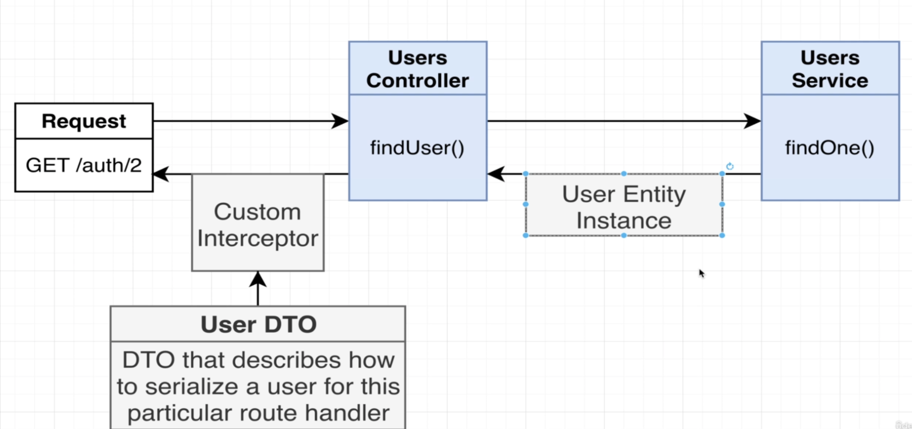
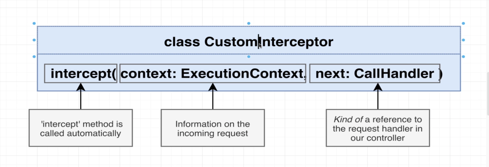

- Database bağlantısını AppModule içerisinde yapacağız. Bu sayede diğer module'lardan erişebileceğiz.
- Entity dosyası içerisinde propertiesleri tanımlarız. fonksiyonellik yok
- Repository içerisinde find, update, delete, create methodlarını tanımlayacağız.
- TypeOrm nedir bi bak
- Entity nasıl oluşturulur?

  - Entity dosyası oluşturacağız ve içinde bir class oluşturacağız
  - Bu class entitynin sahip olmasını beklediğimiz tüm farklı özellikleri listeleyecek (email, password vs)
  - Bu entity'i parent module'a bağlamamız gerek. burası repository'i oluşturdu.(users.module.ts)
  - Entity'i root connection'a (app module) bağlanacağız.

- Veritabanımızda yapısında bir şey değiştirdiğimiz zaman migration çalıştırmamız gerekir. Migration, veritabanının yapısını değiştiren ve çok dikkatli tasarlanmıl bir kod parçasıdır. yeni bir kolon entitiy, kolon adı vs değiştirdiğimizde migration yapmamız gerekiyor.
- şu an bu projede böyle bir yapı kurulmadı. TypeOrm'in bir synchronize diye bir özelliği var ve bu sadece geliştirme ortamında kullanılır. bu true olarak ayarlanırsa veritabanındaki değişikliklerin hepsi otomatik olarak güncellenir. Bunu da Orm sağlar. (app.module.ts)

```
@Module({
  imports: [
    TypeOrmModule.forRoot({
      type: 'sqlite',
      database: 'db.sqlite',
      entities: [User, Report],
      synchronize: true,
    }),
    UsersModule,
    ReportsModule,
  ],
  controllers: [AppController],
  providers: [AppService],
})
```

- typeorm repository api dokümantasyon: https://typeorm.io/repository-api
- dto'lar kullanıcıdan gelen istekleri doğrulamak için kullanır.

Locate the findOne method and update the return to look like this:

findOne(id: number) {
return this.repo.findOneBy({ id });
}
Locate the find method and update the return to look like this:

find(email: string) {
return this.repo.find({ where: { email } });
}

- Get isteği ile bir kullanıcıyı döndürdüğümüz zaman kullanıcının şifresi de geliyor. bu gerçek uygulamada istemediğimiz bir durum.
- Interceptor, nestin içinde bulunan ve gelen isteklere müdahale etmemizi sağlatan araçtır.
- şifre konusu için custom interceptor kullanacağız.
  
  
